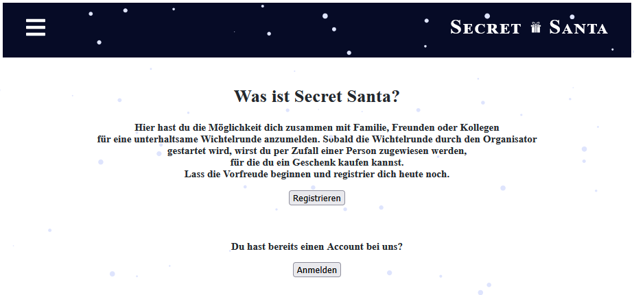
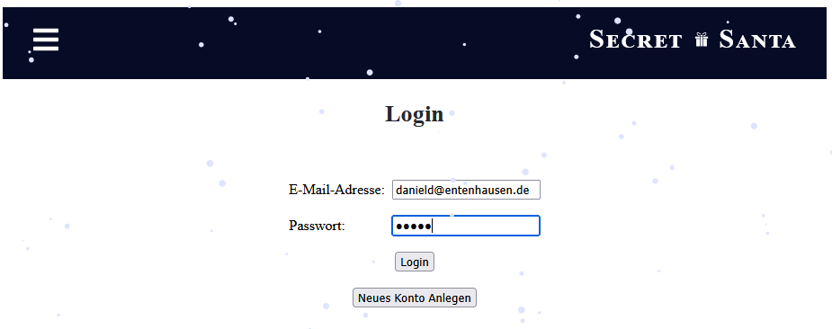
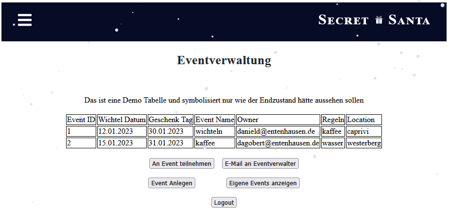
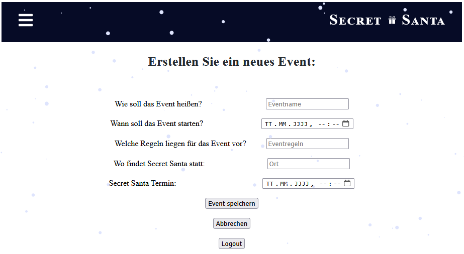
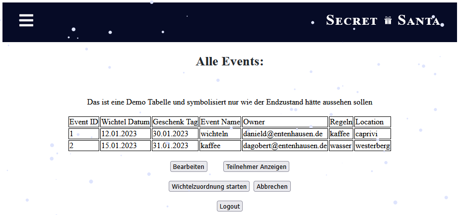
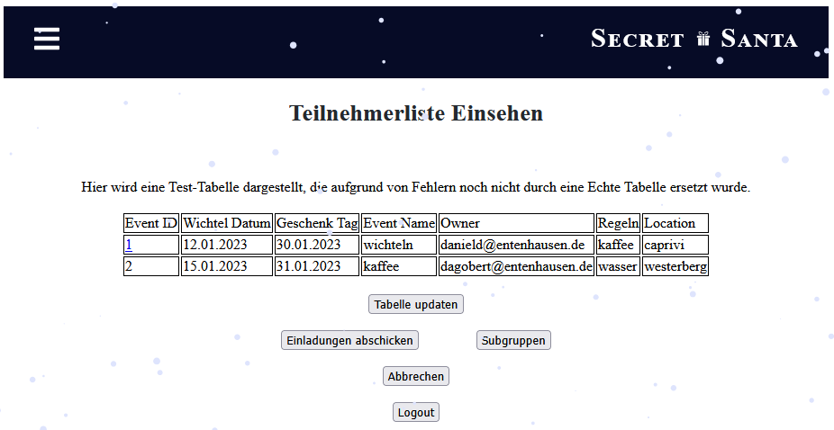
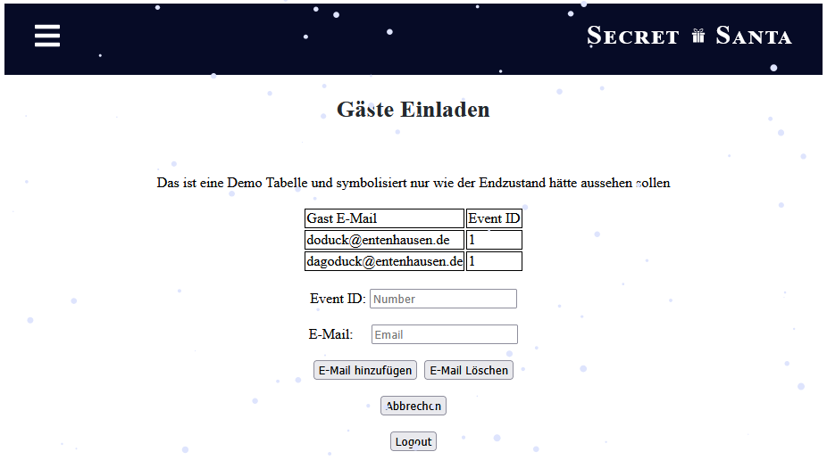
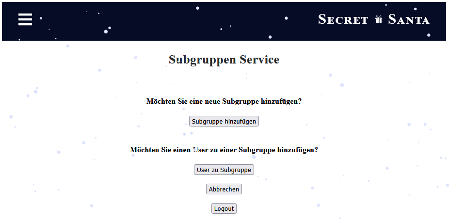
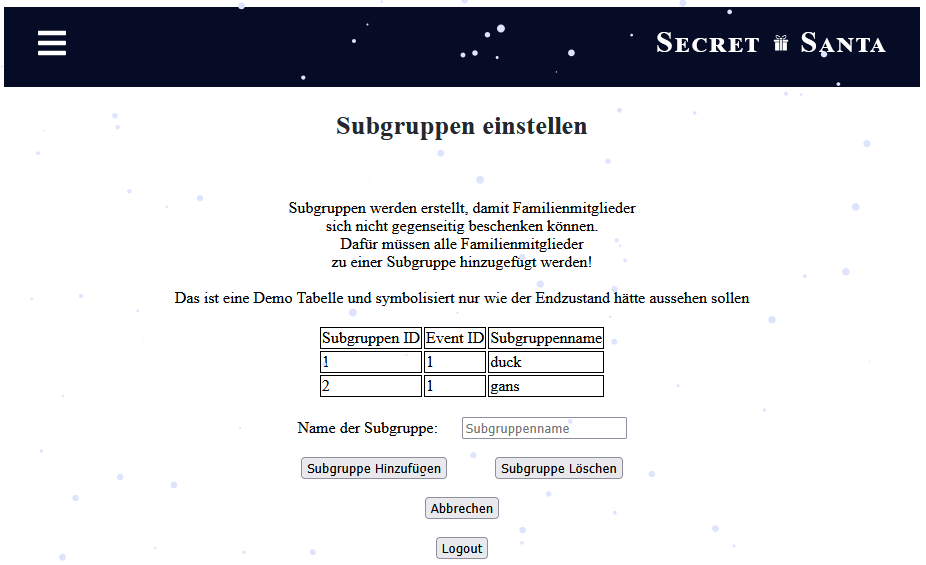
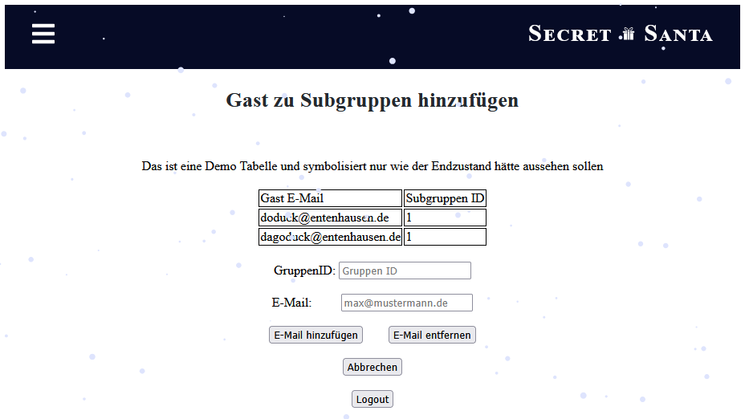

# 🎁 WichtelApp

> University group project with the goal of creating a Secret Santa app.  
> Developed as part of the **IT-Projekt** course.

---
### Landing Screen


---

## 🧭 Motivation

The goal of this course and project was to teach students how to develop a full-stack application collaboratively.”

---

## ⚙️ Features

- 🧾 Account Creation
- 🔐 User-Login & Logout
- 🌐 Access to protected areas after login
- 🎉 Event Creation
- ➕ Adding users to events
- 🎁 Secret Santa assignment ("Wichteln")
- ❌ Automatic cookie deletion on logout

---

## 🧰 Technologie-Stack

| Area                 | Technology / Version              |
|:---------------------|:----------------------------------|
| **Backend**          | Quarkus `2.16.6`, Gradle `7.5.1`  |
| **Frontend / Build** | React `18.2.0`, Node.js `18.12.1` |
| **Database**         | PostgreSQL (Docker)               |
| **Language(s)**      | Java `17`, JavaScript             |

**Quarkus extensions used:**
```gradle
    implementation 'io.quarkus:quarkus-hibernate-orm'
    implementation 'io.quarkus:quarkus-hibernate-validator'
    implementation 'io.quarkus:quarkus-resteasy-jsonb'
    implementation 'io.quarkus:quarkus-smallrye-openapi'
    implementation 'io.quarkus:quarkus-resteasy'
    implementation 'io.quarkus:quarkus-security-jpa'
    implementation 'io.quarkus:quarkus-jdbc-postgresql'
    implementation 'io.quarkus:quarkus-arc'
    implementation 'io.quarkus:quarkus-mailer'
    testImplementation 'io.quarkus:quarkus-junit5'
    testImplementation 'io.rest-assured:rest-assured'
```
> 🧪 Test folders (test and native-test) exist but currently contain no implemented tests.

---
## ⚠️ Development Status

### Backend
| Area                    | Status                           |
|:------------------------|:---------------------------------|
| Login                   | implemented                      |
| User management         | implemented                      |
| Event Setup             | implemented                      |
| Secret Santa assignment | theoretically complete, untested |
| Email notification      | dropped due to time constraints  |

### Frontend
| Area                | Status                                                                  |
|:--------------------|:------------------------------------------------------------------------|
| Login               | implemented and functional                                              |
| User creation       | implemented and functional                                              |
| Event creation      | implemented and functional                                              |
| Display events page | partially implemented table view missing & not yet connected to backend |
| Other pages         | partially implemented & not yet connected to backend                    |

> ⚠️ Note: All pages that allow data entry are functional. However, pages that rely on tables (e.g., for displaying relational data) only have demo tables. Many data entries require primary keys generated by the backend tables, which are not included in the demo setup. As a result, only certain data can be entered successfully.
> Not all buttons are functional. 

### 📸 Current Condition / Screenshots

#### 1. Login Page

*Login page showing entry of login data for test user danield@entenhausen.de.*

#### 2. Eventverwaltung (Demo Table)

*Landing page after login, showing demo table of events. From here, users can create a new event or view events they created. Demo table is used for illustration.*

#### 3. Event Anlegen Page

*Page for creating a new event. Data entry is functional; newly created events are stored in the backend and would appear on the "Eventverwaltung" and "Eigene Events" pages if full integration were active.*

#### 4. Eigene Events (Demo Table)

*Shows all events created by the logged-in user using a demo table. Demo data illustrates layout and navigation.*

#### 5. Teilnehmerliste Page (Demo Table)

*Displays invited participants for a selected event using a demo table. Users can attempt to add participants or create subgroups; full backend integration is not available.*

#### 6. Einladen Page (Demo Table)

*Page for inviting additional users to an event. Demo table is included for layout purposes; data entry is limited by backend constraints.*

#### 7. Subgruppen Main Page

*Navigation page with buttons leading to subgroup creation or adding participants to subgroups.*

#### 8. Subgruppe Erstellen Page (Demo Table)

*Page for creating and deleting subgroups. Demo table illustrates layout; full backend integration is not connected.*

#### 9. User zu Subgruppe Page (Demo Table)

*Page for adding users to subgroups. Demo table is included to show structure; data entry functionality depends on backend keys.*

---

## 🛠️ Installation & Setup
Prerequisites:

- Docker installed and running
- PostgreSQL running in a container
- Java 17, Gradle, Node.js installed (or installed via build script)

Steps:
```shell script
#Clone the repository
git clone https://github.com/pgs3238/WichtelApp.git
cd WichtelApp

# Build project (installs Node, npm dependencies and runs build)
./gradlew build

# Start the application in development mode
./gradlew quarkusDev
```

### 🐳 Database Configuration (Docker)

To run the application locally, a PostgreSQL container must be set up with the following configuration:

| Setting   | Value       |
|:-----------|:------------|
| Host       | `localhost` |
| Port       | `5433`      |
| User       | `quarkus`   |
| Password   | `quarkus`   |
| Database   | `quarkus`   |
| JDBC URL   | `jdbc:postgresql://localhost:5433/quarkus` |

You can start a compatible PostgreSQL container with:

```bash
docker run --name postgres-quarkus \
  -e POSTGRES_USER=quarkus \
  -e POSTGRES_PASSWORD=quarkus \
  -e POSTGRES_DB=quarkus \
  -p 5433:5432 \
  -d postgres:latest
```
---

## 🚀 Usage

1. Start the application
2. Open the login page in your browser
3. Create a user account
4. Log in → cookie will be set
5. Access protected pages
6. You can navigate through the protected pages using the available buttons; however, these pages currently have no backend functionality.
7. Logout → cookie will be deleted

---

## ⚠️ Notes

> 🔒 This project is for learning and demonstration purposes only.
Cookie-based storage of user data is not suitable for production environments.

---

## 🧑‍💻 Author & Contact
| Name                | Area                            | Contact                                                                                                                                                                |
|:--------------------|:--------------------------------|:-----------------------------------------------------------------------------------------------------------------------------------------------------------------------|
| Paul-Gerhard Siegel | Backend (User & Login)          | [GitHub](https://github.com/pgs3238) · [LinkedIn](https://www.linkedin.com/in/paul-gerhard-siegel-719a4512/) · [Xing](https://www.xing.com/profile/PaulGerhard_Siegel) |
| @DirkEves           | Backend (Event)                 |                                                                                                                                                                        |
| @arditv9            | Frontend                        |                                                                                                                                                                        |
| @Rene169            | Frontend & QC (Quality Control) |                                                                                                                                                                        |

> 🧑‍🎓 This project was developed collaboratively as part of the **IT-Projekt** university course.  
> The listed roles reflect the original team division during the course.